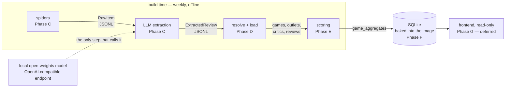

# Architecture — The Build Pipeline

How Final Scoring is put together, in one picture. This document covers
the *shape* of the system: the stages, the record types that pass
between them, and the one rule that explains most of the design. What
has been decided and why lives in `PROJECT.md`; what is still open lives
in `DECISIONS_OPEN.md`; the suggested order of construction lives in
`BUILD_NOTES.md`.

## The rule that explains the shape

**There is no runtime database, and no runtime LLM.** Everything below
happens offline, at build time, roughly weekly. A build reads sources,
produces a complete new SQLite file, and bakes it into the deployable
image. Nothing writes to that database once it ships; the frontend only
reads it. There is therefore no migration system — each build starts
from sources and produces a fresh database.

This mirrors the maintainer's Recommend.Games approach and suits a
read-mostly, batch-updated workload.

## The pipeline



The same picture in plain text, for readers and tools that do not render
Mermaid:

```
  ─── build time — weekly, offline ─────────────────────────────────────────────

    spiders            LLM extraction      resolve + load      scoring
    (Phase C)          (Phase C)           (Phase D)           (Phase E)
       │                      │                   │                │
       ▼                      ▼                   ▼                ▼
    RawItem ──JSONL──> ExtractedReview ──> games, outlets, ──> game_
                              ▲            critics, reviews    aggregates
                              │                                    │
              local open-weights model,                            ▼
              OpenAI-compatible endpoint                ┌────────────────────┐
              — the only step that calls it             │ SQLite, baked into │
                                                        │ the image (Phase F)│
                                                        └──────────┬─────────┘
  ──────────────────── run time ─────────────────────────────────  │  ─────────
                                                                   ▼
                                                           frontend reads it
                                                          read-only (Phase G)
```

Keep the two in sync: they are one diagram in two renderings.

## The seams

Each arrow between stages is a contract. There are three record shapes,
and knowing which is which is most of the mental model.

- **`RawItem`** (`scraping/item.py`) — spider → extraction. A plain
  Pydantic model, not a table; batches of them are written as JSON
  Lines. Deliberately fat: `raw_text` is what the model reads, while
  `raw_html` and the og/oembed/schema.org fields are kept so a page can
  be re-extracted under a new prompt without re-crawling it.
- **`ExtractedReview`** / **`ExtractionResult`** (`scraping/extract.py`)
  — extraction → load. Also plain Pydantic, also JSON Lines. One article
  can yield many: the unit is a (game, reviewer) pair, not a page.
- **The SQLModel tables** (`models/`) — `games`, `outlets`, `critics`,
  `reviews`, `game_aggregates`. Only these are persisted. Everything
  upstream of them is an intermediate artifact: reproducible, gitignored,
  and not the thing to share between machines. Share the SQLite file.

Both intermediate shapes are serialised as JSON Lines, matching the
Recommend.Games pattern. Whether extraction re-emits enriched raw items
as one stream or writes a second stream of its own is not settled — see
`DECISIONS_OPEN.md`. Settle it before building the load step.

Prompts are versioned files rather than string literals
(`scraping/prompts/`), so a change to extraction behaviour arrives as a
reviewable diff. Scoring is meant to be versioned the same way:
`game_aggregates.scoring_version` exists to stamp the methodology onto
each computed row, though the parameters it would name are still open.

## What exists today

As of 2026-08-18: the settings object, the DB bootstrap, all five
tables, `RawItem`, and the `ExtractedReview` schema with prompt v1. The
stages themselves — the spiders, the LLM call, resolution, load,
scoring, and the bake — are not built yet. `BUILD_NOTES.md` tracks the
sequence and is the place to look for what comes next.
